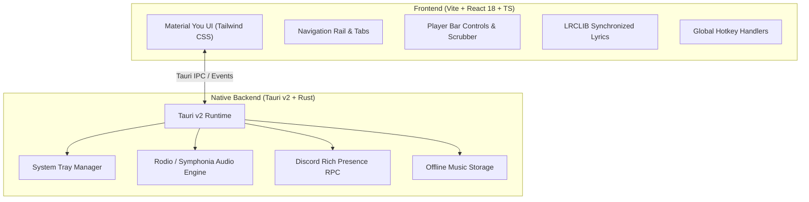

# Time ⏱️

[](LICENSE)
[](https://v2.tauri.app/)
[](https://react.dev/)
[](https://www.typescriptlang.org/)
[](https://tailwindcss.com/)
[](https://www.rust-lang.org/)

> **Time** is an ultra-lightweight, zero-bloat desktop music player built with **Rust** and **Tauri v2**, featuring a striking **monochrome Material You (Material 3 Expressive)** interface.

---

## ✨ Features

- **Monochrome Material You Aesthetics**: Pure black (`#000000`) and tiered neutral surfaces (`#0E0E0E`, `#181818`, `#222222`), expressive pill navigation rails, fluid hover transitions, and custom M3 scrollbars.
- **Ultra-Low Resource Footprint**: Consumes only **~38 MB RAM** and minimal CPU (~0.2%), orders of magnitude lighter than heavy Electron-based music players.
- **Synchronized Karaoke Lyrics**: Real-time line-by-line synchronized lyrics powered by LRCLIB with interactive seeking and center-aligned autoscroll.
- **Native Desktop Integration**:
  - Borderless frameless window with custom minimal desktop titlebar controls.
  - Seamless system tray minimize and background playback.
  - Global keyboard shortcuts for hands-free audio control.
  - Discord Rich Presence status support.
- **Offline Library**: Cache and download favorite songs locally for instant playback without an active internet connection.
- **Smart Queue & Playback**: Shuffle, repeat, scrubber timeline seeking, and smooth volume ramping.

---

## 🎹 Keyboard Shortcuts

| Shortcut | Action |
| :--- | :--- |
| <kbd>Space</kbd> | Toggle Play / Pause |
| <kbd>→</kbd> | Seek forward 5 seconds |
| <kbd>←</kbd> | Seek backward 5 seconds |
| <kbd>Esc</kbd> / Close button | Minimize to system tray (background playback continues) |

---

## 🛠️ Architecture & Tech Stack



- **Frontend**: React 18, TypeScript, Tailwind CSS, Vite, Google Sans / Inter typography, Material Symbols Rounded.
- **Backend**: Rust 2021 edition, Tauri v2 (`tray-icon`, `plugin-shell`), Rodio audio engine with Symphonia decoders, Tokio async runtime, Reqwest HTTP client.

---

## 🚀 Getting Started

### Prerequisites

- [Node.js](https://nodejs.org/) (version 20 LTS or later)
- [Rust](https://www.rust-lang.org/tools/install) (stable toolchain)
- Platform-specific build tools:
  - **Windows**: Microsoft C++ Build Tools & WebView2 (included on Windows 10/11)
  - **Linux (Ubuntu/Debian)**:
    ```bash
    sudo apt-get update && sudo apt-get install -y \
      libwebkit2gtk-4.1-dev \
      libayatana-appindicator3-dev \
      librsvg2-dev \
      patchelf \
      libasound2-dev \
      libssl-dev
    ```
  - **macOS**: Xcode Command Line Tools (`xcode-select --install`)

### Installation

1. Clone the repository:
   ```bash
   git clone https://github.com/your-username/time.git
   cd time
   ```

2. Install frontend dependencies:
   ```bash
   npm install
   ```

3. Run in development mode:
   ```bash
   npm run tauri dev
   ```

---

## 📦 Production Build

To compile a native, stripped, release binary with Link-Time Optimization (LTO):

```bash
npm run tauri build
```

The compiled binaries and native installers (`.msi` / `.exe` on Windows, `.deb` / `.AppImage` on Linux, `.dmg` / `.app` on macOS) will be generated inside:
```
src-tauri/target/release/bundle/
```

---

## 🤖 CI / CD Pipeline

The repository includes a GitHub Actions workflow [`.github/workflows/release.yml`](.github/workflows/release.yml) that automatically builds multi-platform binaries upon tag creation (`v*`) or manual dispatch:

- **Windows**: Produces portable `.exe` and `.msi` installers.
- **Ubuntu 22.04**: Produces `.deb` and standalone `.AppImage` bundles with ALSA / WebKit2GTK 4.1 support.
- **macOS**: Produces universal binaries (`x86_64` and `aarch64` Apple Silicon) packaged as `.dmg`.
- Automatically publishes binaries to GitHub Releases with release notes.

---

## 📄 License

This project is licensed under the [MIT License](LICENSE).
